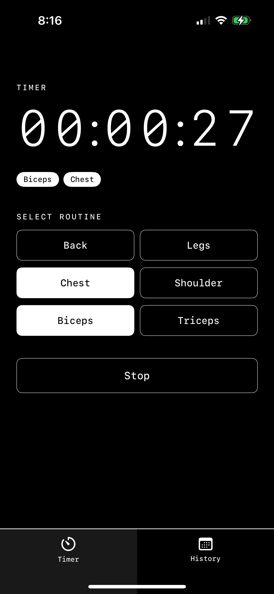
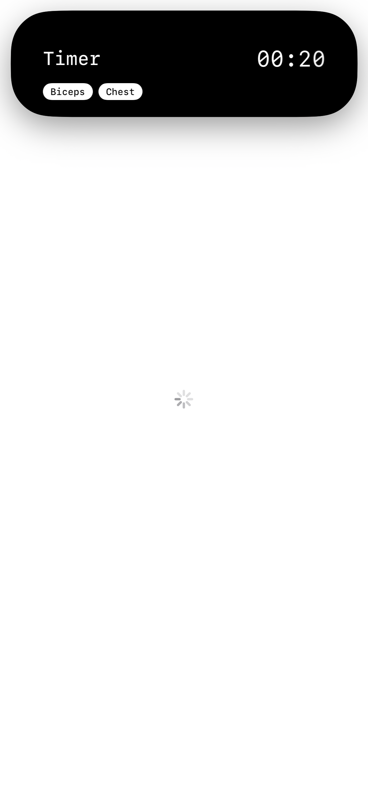
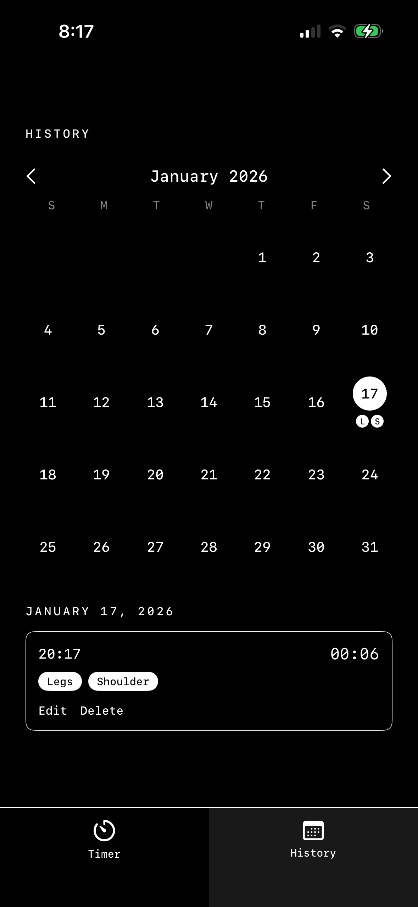
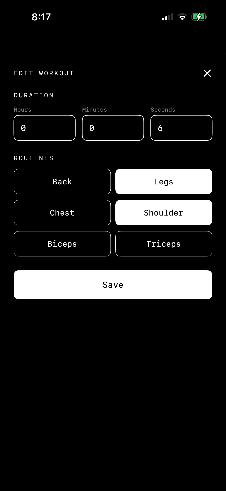

# Big Timer

A minimalist workout timer app for iOS with Dynamic Island integration and Live Activities support.

## Features

### Timer View
Clean, monospaced timer display with routine selection for tracking your workout sessions.



### Dynamic Island Integration
Real-time timer updates in the Dynamic Island while using other apps.



### Workout History
Track your past workout sessions with detailed duration and routine information.



### Edit History
Manage and edit your workout history entries.



## Routine Options
- Back
- Legs
- Chest
- Shoulder
- Biceps
- Triceps

## Requirements
- iOS 16.0+
- Xcode 14.0+
- Swift 5.0+

## Technologies
- SwiftUI
- ActivityKit
- Live Activities
- Dynamic Island

## Installation

1. Clone the repository
```bash
git clone https://github.com/yourusername/Big-Timer.git
```

2. Open `Big Timer.xcodeproj` in Xcode

3. Build and run on your device or simulator

## License

Copyright © 2026 Donghyun Lee. All rights reserved.
